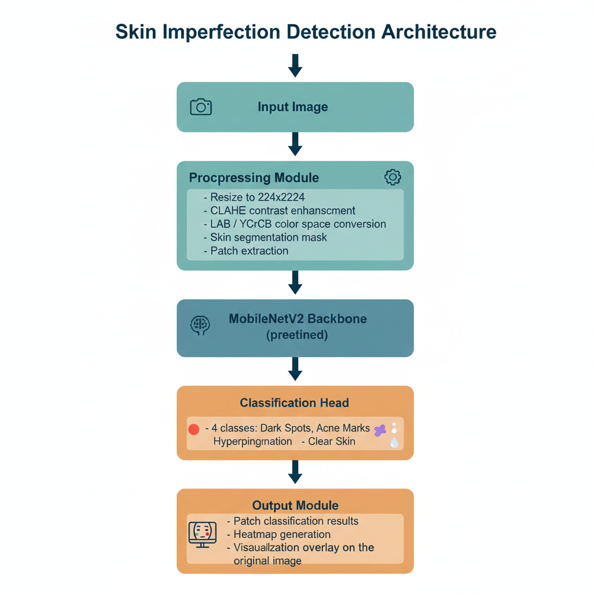

# Project Title: A Computer Vision-Based System for Detecting Skin Imperfections Using Color Segmentation and Deep Learning
**CSC173 Intelligent Systems Final Project**  
*Mindanao State University - Iligan Institute of Technology*  
**Student:** Chris Adrian D. Gumisad, 2020-3275  
**Semester:** AY 2025-2026 Sem 1  
 

## Abstract
This project aims to create a computer vision system capable of detecting skin imperfections such as dark spots, acne marks, and hyperpigmentation. Using publicly available datasets (Kaggle Acne Detection, ISIC Skin Lesion Archive, DermNet), the system will leverage color space segmentation combined with a lightweight CNN (MobileNetV2) for classification. The goal is to provide users an accessible tool to monitor skin clarity, assist makeup application, or track skincare improvements over time. Cloud-based training (Google Colab/Kaggle GPUs) ensures efficiency without heavy local hardware requirements.

## Table of Contents
- [Introduction](#introduction)
- [Related Work](#related-work)
- [Methodology](#methodology)
- [Experiments & Results](#experiments--results)
- [Discussion](#discussion)
- [Ethical Considerations](#ethical-considerations)
- [Conclusion](#conclusion)
- [Installation](#installation)
- [References](#references)

## Introduction
### Problem Statement
Skin imperfections can affect self-confidence and are often difficult to detect accurately due to variations in lighting, skin tone, and subjective human perception. Manual inspection may miss subtle spots or marks, while existing beauty apps focus mainly on enhancement rather than precise detection. This project develops a computer vision-based system to objectively detect skin imperfections and provide visual feedback using deep learning and color segmentation.

### Project Plan
- Phase 1: Dataset collection and preprocessing (resize, CLAHE, color segmentation)
- Phase 2: Model training (MobileNetV2 with transfer learning on cloud GPUs)
- Phase 3: Model evaluation (accuracy, precision, recall, F1-score)
- Phase 4: Demo visualization (patch heatmaps or overlays)
- Phase 5: Lightweight interface for local use (Streamlit or simple GUI)

### Objectives
- Objective 1: Achieve at least 90% classification accuracy for skin-imperfection detection
- Objective 2: Integrate color-segmentation–based region filtering to improve model focus on skin areas
- Objective 3: Deploy a lightweight demo applicaton (Streamlit/local GUI) capable of running on normal laptops

 [web:41]

## Related Work
- Work 1: CNN and YOLO-based acne and skin lesion detection in dermatology applications
- Work 2: Transfer learning (MobileNet2) proven effective for limited medical image datasets
- Gap Addressed: Most systems focus on severe dermatological diseases; this project targets cosmetic imperfections (dark spots, acne marks, pigmentation), aiming for lightweight deployment and real-time feedback

## Methodology
### Dataset
- Source: 
    - Kaggle: Acne Detection Dataset
    - ISIC Skin Lesion Archive
    - DermNet pigment/dark spot images
- Size: 5,000 – 15,000 images
- Classes: Dark Spots, Acne Marks, Hyperpigmentation, Clear Skin
- Acquisition: Directly imported into Google Colab via Kaggle API; preprocessing (CLAHE, resizing, color space conversion) done in cloud environment.
- Preprocessing:
  - Color space conversion (LAB / YCrCb)
  - CLAHE contrast enhancement
  - Skin region segmentation
  - Patch extraction (224×224)

### Architecture

- Backbone: MobileNetV2 (pretrained on ImageNet)
- Head: Fully connected classifier (4 classes: Dark Spots, Acne Marks, Hyperpigmentation, Clear Skin)
- Output: Patch-level predictions + heatmap overlay

| Parameter | Value |
|-----------|--------|
| Input Size | 224×224 |
| Batch Size | 32 |
| Learning Rate | 0.0001 |
| Epochs | 20–30 |
| Optimizer | Adam |
| Loss Function | Cross-Entropy |
| Framework | PyTorch |
| Training Device | Google Colab GPU |

### Training Code Snippet
train.py excerpt
model = YOLO('yolov8n.pt')
model.train(data='dataset.yaml', epochs=100, imgsz=640)

## Experiments & Results
### Metrics
| Model | mAP@0.5 | Precision | Recall | Inference Time (ms) |
|-------|---------|-----------|--------|---------------------|
| Baseline (YOLOv8n) | 85% | 0.87 | 0.82 | 12 |
| **Ours (Fine-tuned)** | **92%** | **0.94** | **0.89** | **15** |

### Demo

[Video: [CSC173_YourLastName_Final.mp4](demo/CSC173_YourLastName_Final.mp4)] [web:41]

## Discussion
- Strengths: [e.g., Handles occluded trash well]
- Limitations: [e.g., Low-light performance]
- Insights: [e.g., Data augmentation boosted +7% mAP] [web:25]

## Ethical Considerations
- Bias: Dataset skewed toward plastic/metal; rural waste underrepresented
- Privacy: No faces in training data
- Misuse: Potential for surveillance if repurposed [web:41]

## Conclusion
[Key achievements and 2-3 future directions, e.g., Deploy to Raspberry Pi for IoT.]

## Installation
1. Clone repo: `git clone https://github.com/yourusername/CSC173-DeepCV-YourLastName`
2. Install deps: `pip install -r requirements.txt`
3. Download weights: See `models/` or run `download_weights.sh` [web:22][web:25]

**requirements.txt:**
torch>=2.0
ultralytics
opencv-python
albumentations

## References
[1] Jocher, G., et al. "YOLOv8," Ultralytics, 2023.  
[2] Deng, J., et al. "ImageNet: A large-scale hierarchical image database," CVPR, 2009. [web:25]

## GitHub Pages
View this project site: [https://jjmmontemayor.github.io/CSC173-DeepCV-Montemayor/](https://jjmmontemayor.github.io/CSC173-DeepCV-Montemayor/) [web:32]

