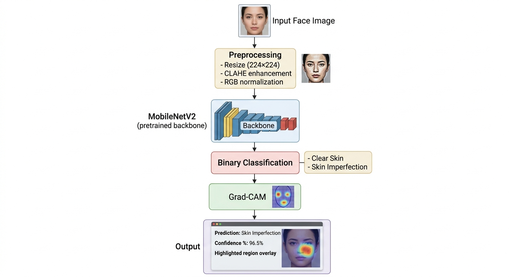
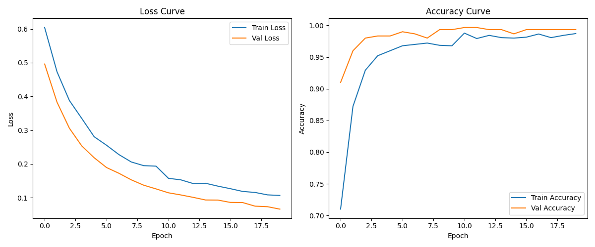
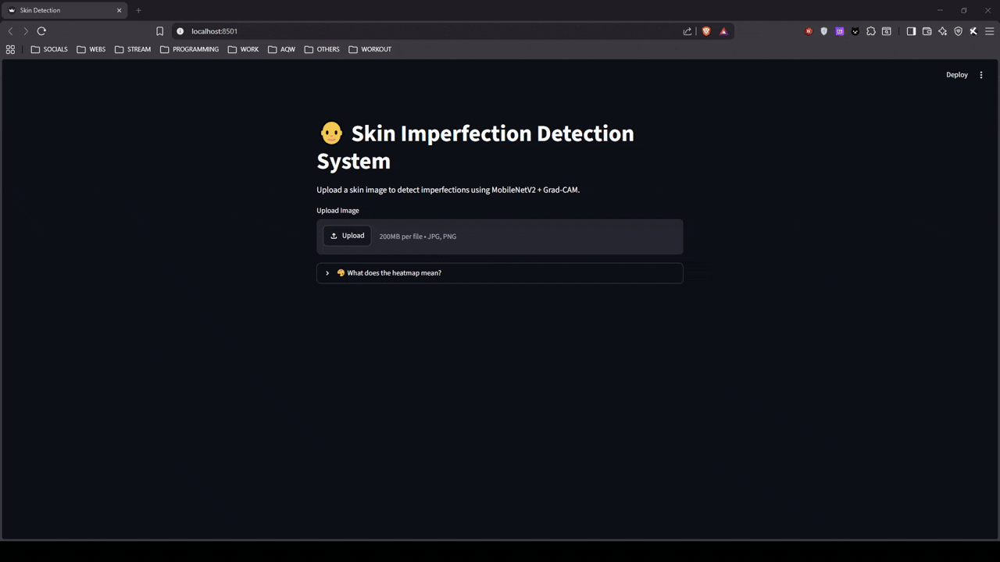

# Project Title: A Deep Learning-Based Skin Imperfection Detection System Using MobileNetV2 and Grad-CAM
**CSC173 Intelligent Systems Final Project**  
*Mindanao State University - Iligan Institute of Technology*  
**Student:** Chris Adrian D. Gumisad, 2020-3275  
**Semester:** AY 2025-2026 Sem 1  
 

## Abstract
This project develops a lightweight computer vision system that detects skin imperfections such as acne marks, dark spots, and discoloration. The system uses a pretrained MobileNetV2 model fine-tuned on a curated dataset of approximately 1000 images. It performs binary classification (Clear Skin vs Skin Imperfection) and uses Grad-CAM to visualize affected regions. Training is done using Google Colab with GPU support, while inference and testing can be done locally using VSCode.

## Table of Contents
- [Introduction](#introduction)
- [Related Work](#related-work)
- [Methodology](#methodology)
- [Experiments & Results](#experiments--results)
- [Discussion](#discussion)
- [Ethical Considerations](#ethical-considerations)
- [Conclusion](#conclusion)
- [Installation](#installation)
- [References](#references)

## Introduction
### Problem Statement
Skin imperfections are difficult to detect consistently due to lighting conditions, skin tone variations, and subjective human judgment. Existing beauty applications often focus on enhancement rather than accurate detection and analysis.This project proposes a computer vision system that can objectively classify skin images into clear or imperfect categories and provide visual explanations of predictions using deep learning.

### Project Plan
- Phase 1: Dataset collection and curation (~1000 handpicked images per class: Clear Skin and Skin Imperfection)
- Phase 2: Image preprocessing (resizing to 224×224, CLAHE enhancement, normalization)
- Phase 3: Model training using MobileNetV2 with transfer learning on Google Colab
- Phase 4: Model evaluation using accuracy, precision, recall, F1-score, and confusion matrix
- Phase 5: Explainability using Grad-CAM visualization for region highlighting
- Phase 6: Model export to ONNX and lightweight local inference using VSCode + Streamlit demo

### Objectives
- Objective 1: Train a binary classifier (Clear Skin vs Skin Imperfection) using MobileNetV2 with transfer learning
- Objective 2: Build a curated dataset of approximately 1000 images per class with proper labeling and cleaning
- Objective 3: Apply image preprocessing techniques including resizing, CLAHE enhancement, and normalization
- Objective 4: Achieve strong classification performance using cloud-based training (Google Colab GPU)
- Objective 5: Evaluate model performance using accuracy, precision, recall, F1-score, and confusion matrix on a held-out test set
- Objective 6: Generate Grad-CAM heatmaps to visually explain model predictions
- Objective 7: Deploy a lightweight inference system using ONNX and a Streamlit-based local demo

 [web:41]

## Related Work
- CNN-based approaches have been widely used for skin lesion and acne detection tasks, demonstrating strong performance in image classification problems.
- Transfer learning using lightweight architectures such as MobileNetV2 has proven effective for small to medium-sized medical and cosmetic image datasets.
- Most existing systems focus on disease diagnosis or clinical dermatology; this project instead targets cosmetic-level skin analysis such as acne marks, dark spots, and pigmentation, with an emphasis on lightweight deployment and interpretability using Grad-CAM.

## Methodology

### Dataset
- **Source:**
  - Kaggle skin and acne-related datasets
  - Public dermatology image datasets (e.g., ISIC, DermNet)
  - Manually curated and filtered internet-sourced images

- **Size:** ~1000 images total (balanced dataset)

- **Classes:**
  - Clear Skin
  - Skin Imperfection (acne marks, dark spots, pigmentation)

- **Acquisition:**
  - Downloaded via Kaggle API in Google Colab
  - Manually cleaned, filtered, and labeled
  - Split into train, validation, and test sets

- **Preprocessing:**
- Resize images to 224×224 (required for MobileNetV2)
- Apply CLAHE (Contrast Limited Adaptive Histogram Equalization) for contrast enhancement
- Normalize pixel values using ImageNet statistics
- Convert images to tensor format for PyTorch pipeline  

### Architecture

- **Backbone:** MobileNetV2 (pretrained on ImageNet)
- **Task:** Binary image classification (Clear Skin vs Skin Imperfection)
- **Input:** 224×224 RGB skin images
- **Output:** Predicted class + confidence score
- **Explainability:** Grad-CAM heatmap overlay highlighting important regions used for prediction
- **Deployment:** ONNX export for lightweight inference + Streamlit demo application

| Parameter | Value |
|-----------|--------|
| Input Size | 224×224 |
| Batch Size | 32 |
| Learning Rate | 0.0001 |
| Epochs | 20 |
| Optimizer | Adam |
| Loss Function | CrossEntropyLoss |
| Framework | PyTorch |
| Training Device | Google Colab GPU (T4/A100) |

### Training Code Snippet
- MobileNetV2
- CrossEntropyLoss
- PyTorch training loop
- Your real binary classifier setup

## Experiments & Results
### Evaluation Metrics (Test Set)

| Metric | Clear Skin | Imperfection | Overall |
|--------|------------|--------------|----------|
| Precision | 0.99 | 1.00 | 0.995 |
| Recall | 1.00 | 0.99 | 0.995 |
| F1-score | 0.99 | 0.99 | 0.99 |
| Support | 150 | 150 | 300 |

### Overall Performance
- **Test Accuracy:** 99%
- **Model:** MobileNetV2 (fine-tuned)
- **Task:** Binary classification (Clear vs Imperfection)

### Confusion Matrix
- Very low misclassification rate observed
- Balanced performance across both classes

### Inference Performance

| Metric | Value |
|--------|------|
| Average Inference Time | 39.94 ms |
| FPS | 25.04 FPS |
| Model Format | PyTorch + ONNX |
| Deployment | Streamlit (local demo) |

### Demo

[Video: [CSC173_Gumisad_Final.mp4](demo/CSC173_Gumisad_Final.mp4)] [web:41]

## Discussion

### Strengths
- The model achieved high classification performance (~99% test accuracy) in distinguishing Clear Skin from Skin Imperfection images.
- MobileNetV2 provides efficient and lightweight inference suitable for low-end devices.
- Grad-CAM visualization improves interpretability by highlighting regions contributing to predictions.
- ONNX export enables faster and more portable inference for local deployment.

### Limitations
- Performance depends on image quality and lighting conditions.
- Small dataset size (~1000 images) may limit generalization to real-world diversity.
- Model may still be sensitive to extreme skin tones or unusual image angles.
- Binary classification limits detailed categorization of different types of imperfections.

### Insights
- Pretrained MobileNetV2 significantly improves convergence on small datasets.
- CLAHE preprocessing improves contrast and helps highlight skin texture features.
- Grad-CAM helps validate that the model focuses on relevant skin regions rather than background artifacts.

## Ethical Considerations

- **Bias:** The dataset may not fully represent all skin tones, lighting conditions, or camera qualities, which can affect model fairness and generalization.
- **Privacy:** All images used are publicly sourced or manually curated; no personal identity data is stored or processed.
- **Misuse:** The system is designed for educational and research purposes only and should not be used as a medical diagnostic tool.

## Conclusion

This project successfully developed a lightweight deep learning-based system for detecting skin imperfections using MobileNetV2 and Grad-CAM visualization. The model achieved strong performance on a curated dataset, with approximately 99% accuracy on the test set.

Key achievements include:
- Development of a binary classification model for skin analysis
- Integration of image preprocessing techniques (CLAHE, normalization, resizing)
- Implementation of Grad-CAM for model interpretability
- Deployment-ready pipeline using ONNX and Streamlit

### Future Work
- Expand dataset to include more diverse skin tones and lighting conditions
- Extend classification to multi-class skin conditions (e.g., acne, pigmentation, scars)
- Improve robustness using data augmentation and larger datasets
- Deploy system as a mobile or web-based application for real-time usage

## Installation
1. Clone repo: `git clone https://github.com/Aeonalyxx/CSC173-DeepCV-Gumisad`
2. Venv setup (If running in local)
2. Install deps: `pip install -r requirements.txt`
3. Streamlit run command: `streamlit run app.py` (in app folder)

**requirements.txt:**
matplotlib==3.10.9
numpy==2.4.6
onnx==1.21.0
onnxruntime==1.26.0
onnxscript==0.7.0
opencv-python==4.13.0.92
pillow==12.2.0
scikit-learn==1.8.0
streamlit==1.58.0
torch==2.12.0
torchvision==0.27.0
tqdm==4.67.3
ipykernel==7.2.0
seaborn==0.13.2

## References
[1] He, K. et al. “Deep Residual Learning for Image Recognition.” CVPR, 2016
[2] Sandler, M. et al. “MobileNetV2: Inverted Residuals and Linear Bottlenecks.” CVPR, 2018
[3] Kaggle Acne and CelebA Dataset

## GitHub Pages
View this project site: [https://Aeonalyxx.github.io/CSC173-DeepCV-Gumisad/](https://Aeonalyxx.github.io/CSC173-DeepCV-Gumisad/) [web:32]

