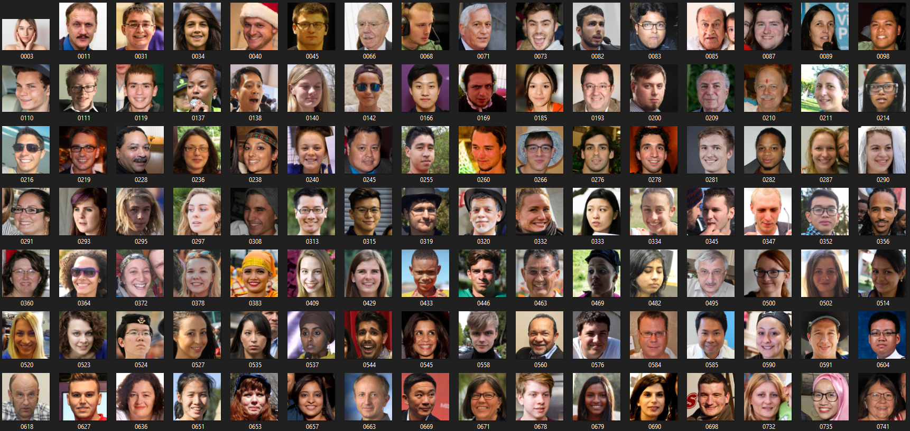

# CSC173 Deep Computer Vision Project Progress Report
**Student:** Chris Adrian Gumisad, 2020-3275  
**Date:** 31/05/2026
**Repository:** [https://github.com/Aeonalyxx/CSC173-DeepCV-Gumisad](https://github.com/Aeonalyxx/CSC173-DeepCV-Gumisad)  
**Commits Since Proposal:** 4 | **Last Commit:** 02/06/2026

## 📊 Current Status
| Milestone | Status | Notes |
|-----------|--------|-------|
| Dataset Preparation | ✅ Completed | [X] images downloaded/preprocessed |
| Initial Training | ✅ In Progress | [X] epochs completed |
| Baseline Evaluation | ⏳ Pending | Training ongoing |
| Model Fine-tuning | ⏳ Not Started | Planned for tomorrow |

## 1. Dataset Progress
- **Total images:** 2000
- **Train/Val/Test split:** 70%/15%/15%
- **Classes implemented:** Clear skin, Skin Imperfection
- **Preprocessing applied:** Image resizing (224 × 224), CLAHE enhancement, RGB normalization, Data Augmentation, Dataset splitting (Train / Validation / Test)

**Sample data preview:**

## 2. Training Progress

**Training Curves (so far)**

**Current Metrics:**
| Metric | Train | Val |
|---------|---------|---------|
| Loss | 0.1574 | 0.1145 |
| Accuracy | 0.9879 | 0.9967 |

**Test Set Evaluation**
| Metric | Value |
|----------|----------|
| Accuracy | 99.0% |
| Precision | 0.99 |
| Recall | 0.99 |
| F1-score | 0.99 |

**Classification Report**
| precision | recall | f1-score | support |
|----------|----------|----------|----------|
| Clear Skin | 0.99 | 1.00 | 0.99 | 150 |
| Imperfection | 1.00 | 0.99 | 0.99 | 150 |
|----------|----------|----------|----------|
| accuracy |          | 0.99 | 300 |
| macro avg | 0.99 | 0.99 | 0.99 | 300 |
| weighted avg | 0.99 | 0.99 | 0.99 | 300 |

## 3. Challenges Encountered & Solutions
| Issue | Status | Resolution |
|-------|--------|------------|
| Issue	Status	Resolution Limited local hardware | ✅ Fixed | Used lightweight MobileNetV2 and ONNX Runtime |
| Dataset inconsistency | ✅ Fixed | Manually curated and verified images |
| Small dataset size | ✅ Fixed | Balanced classes |
| Model explainability | ✅ Fixed | Implemented Grad-CAM visualization|
| Local deployment efficiency | ✅ Fixed | Streamlit + ONNX Runtime integration |

## 4. Next Steps (Before Final Submission)
- [/] Complete training
- [/] Perform final testing and validation
- [ ] Record 5-min demo video
- [ ] Write complete README.md with results
